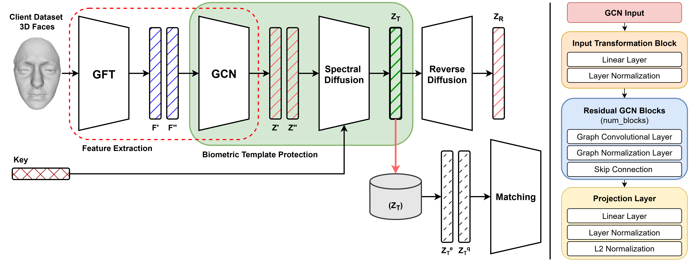

# GFT-GCN: Privacy-Preserving 3D Face Mesh Recognition with Spectral Diffusion

  

---

  
3D face recognition offers a robust biometric solution by capturing facial geometry, providing resilience to variations in illumination, pose changes, and presentation attacks. Its strong spoof resistance makes it suitable for high-security applications, but protecting stored biometric templates remains critical. We present GFT-GCN, a privacy-preserving 3D face recognition framework that combines spectral graph learning with diffusion-based template protection. Our approach integrates the Graph Fourier Transform (GFT) and Graph Convolutional Networks (GCN) to extract compact, discriminative spectral features from 3D face meshes. To secure these features, we introduce a spectral diffusion mechanism that produces irreversible, renewable, and unlinkable templates. A lightweight client-server architecture ensures that raw biometric data never leaves the client device. Experiments on the BU-3DFE and FaceScape datasets demonstrate high recognition accuracy and strong resistance to reconstruction attacks. Results show that GFT-GCN effectively balances privacy and performance, offering a practical solution for secure 3D face authentication.

---
